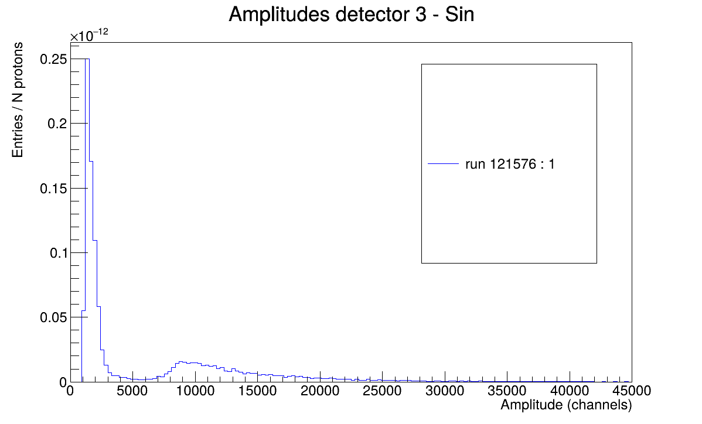
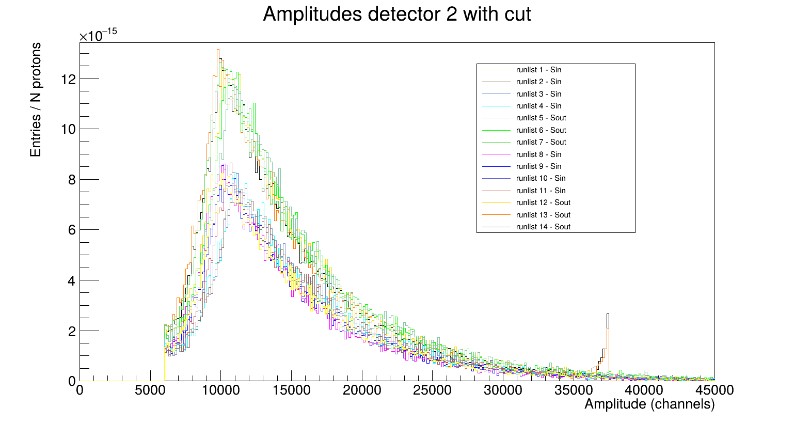
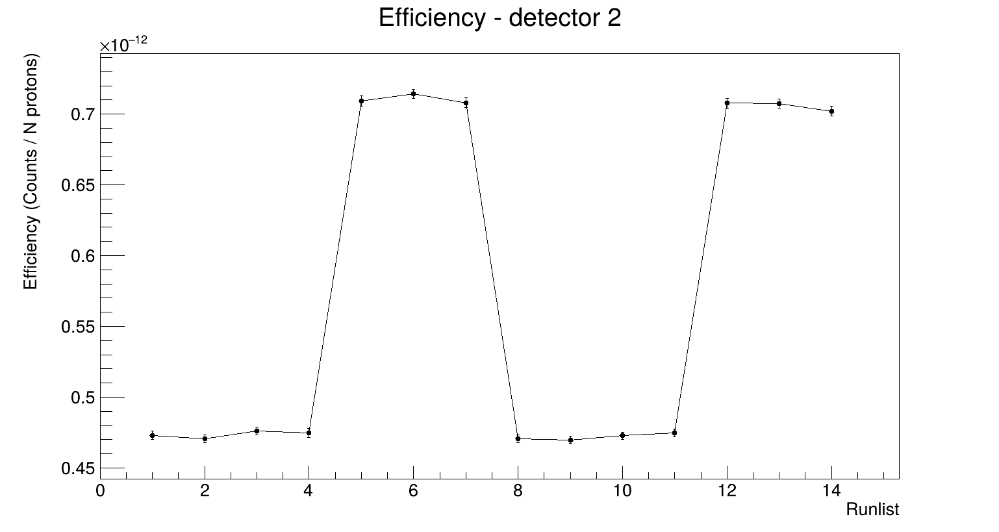
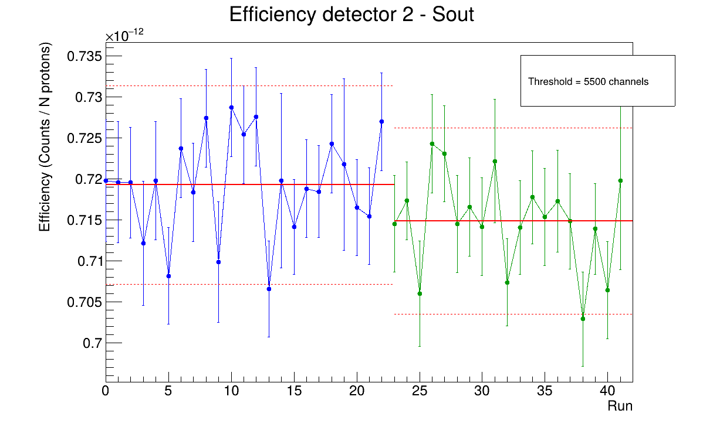
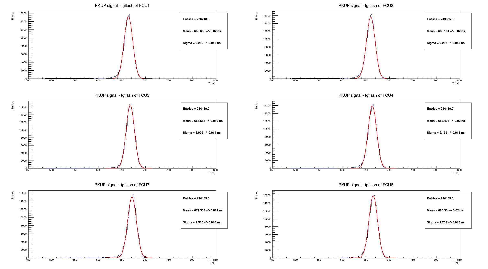
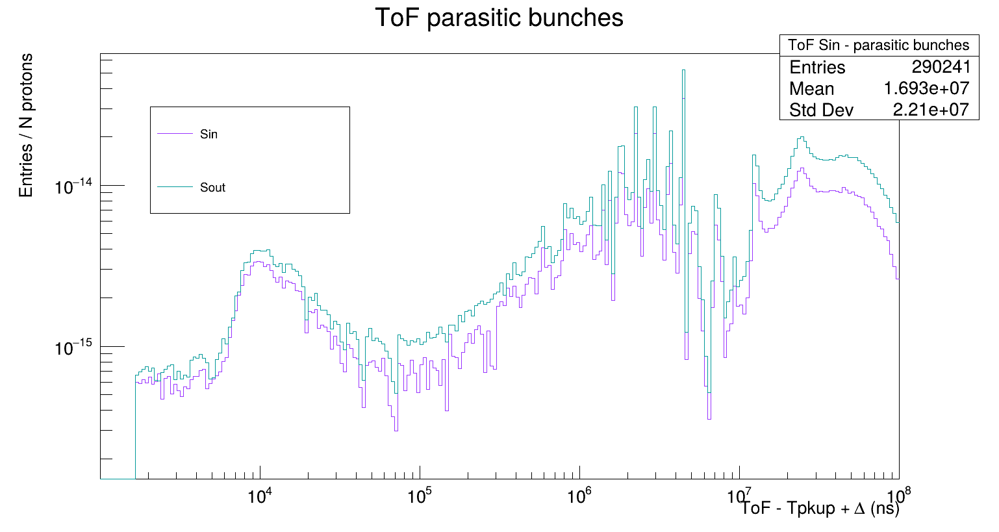
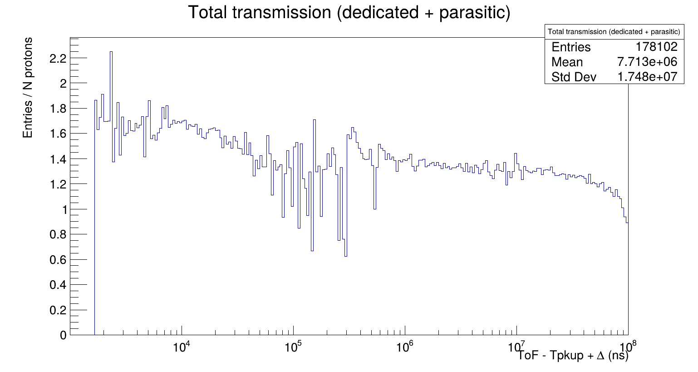

# CuTransmission_analysis
## Table of Contents
- [Introduction](#introduction)
- [The experiment](#the-experiment)
  - [n_TOF Facility](#n_tof-facility)
  - [Cu transmission measurement](#cu-transmission-measurement)
  - [Data files](#data-files)
- [This analysis](#this-analysis)
- [The project](#the-project)
  - [File structure](#file-structure)
  - [Workflow](#workflow)
    - [Input Configuration System](#input-configuration-system)
    - [Main codes](#main-codes)
- [Examples of output](#examples-of-output)  
- [Requirements](#requirements)
- [Usage](#usage)
  - [Bash](#bash)
  - [Docker](#docker)

## Introduction
This project has the purpose of analysing data for the copper transmission measurement performed at n_TOF@CERN.
The final objective of the experiment is to extract the neutron-copper cross-section as a function of energy.
This analysis focuses on the optimisation of the data, studying the stability of the detectors across the whole measurment and optimizing the boundary conditions, in order to enable the extraction of the most accurate value of cross-section from the available data.

## The experiment
The experiment consists on the irradiation of a copper sample with a neutron beam, whose energy span from few meV to GeV.
### n_TOF Facility
The neutron beam is produced by the n_TOF facility thanks to the presence of a spallation target. A beam of protons coming from CERN's Proton Synchrotron is sent to the facility, where it encounters a target made of lead, giving rise to spallation reactions, from which a large number of neutrons is produced. Thanks to a series of collimators, shieldings and sweeping magnets, a well-focused neutron beam is obtained.
It is then sent to the experimental areas, where experiments take place.
There is another beam of protons, of lower intensity, coming from another accelerator. The latter are called "parasitic" bunches while the ones cominhìg for the Proton Synchrotron are the dedicated.
Just before the lead target, a detector, named PKUP, is placed. Its purpose is to register information about the incoming proton bunches.<bf>
To calculate the energy of the neutrons, the time-of-flight technique is used. Since the distance travelled by the neutrons is fixed, by calculating the time between their production and their arrival, the velocity, and hence the kinetic energy, can be extracted. Their production time can be retrieved by the gamma-flash signal, which is a signal generated by the large number of photons that are produced in the spallation reaction.
### Cu transmission measurement
In the measurement under analysis, a copper sample was placed on the neutron beam, so that neutron-copper reactions could be studied.
The cross-section can be extracted by a comparison of the neutron flux measured with ("Sample-in") and without ("Sample-out") the sample on beam. For this reason, the campaign has been divided in 4 phases, alternating Sample-in and Sample-out measurements.<bf>
Since the detector must be able to register the neutron flux, a fission chamber (FC-U) has been chosen for this case. It consists of a gas chamber that contains 8 foils of Uranium. When neutrons impinge on these foils, they fission the Uranium nuclei. The fragments produced from these reactions ionise the gas inside the chamber, producing a signal which is registered. Only 6 out of the 8 detectors are used (foils 5 and 6 are disconnected).
### Data files 
All the information about the interactions, such as the time of flight or the amplitude of the signals, are saved into root files, after going through a pulse shape analysis procedure. Each root file contains the data of one run, which corresponds to about 3 hours of data taking - more precisely, the run is stopped when the accumulated statistic reaches 2e16 protons.
The root files are organized into root trees. To each detector corresponds one tree, whose leaves contain information on the different variables that characterize the interaction.
Since the FC-U detector has many modules, it is possible also to select and analyse each one separately, by reading the leaf "detn".

## This analysis
In this project, the data acquired throughout the whole experiment is analysed from different perspectives, with the goal of extracting of the most accurate possible value of cross-section.<bf>
The first analysis is the evaluation of stability of the detectors. For this purpose, several groups of runs spread equally across all the campaign are selected. For each, an histogram filled with their amplitudes is plotted, to see if there is a deformation or shift over time.
This first plot allows at the same time to get and idea of the behaviour of detectors over the whole measurement campaign and to select an amplitude threshold that is suitable for all the runs.
Indeed, the typical amplitude spectra presents two peaks, the first being the result of electronic noise and background signals, and the second one, at higher amplitudes, corresponding to the useful signals (see image below).



Since the final analysis needs to be performed only for the useful signal, it is essential to define an amplitude threshold that will be used to select only the relevant data. Since the optimal amplitude threshold might change for each detector, because they might have different gains, the former plot is produced for each detector separately. In this way, 6 amplitude thresholds has been chosen, and will be used in the following steps of the analysis.

Then, for each group, the efficiency is computed. This parameter corresponds to the number of counts of the amplitude histogram, normalized to the number of protons, above the threshold. This plot is repeated for each detector separately. This is a way to analyse the stability from a quantitative point of view.

Then, a detailed study of the single runs was performed. It has been done separately for Sample-in and Sample-out data and the two groups of Sin or Sout have been plotted in different colours, to highlight any potential change.  
From the amplitude spectra of each run, two quantities were studied and plotted as a function of the run number. One is the position of the maximum bin over the amplitude threshold, from which it is possible to observe clearly if there has been a gain shift over time.
The second quantity is again the efficiency, this time computed for all the runs. The efficiency values were grouped in a histogram, whose mean and standard deviation values were extracted. Over the efficiency graph, a straight line has been plotted in correspondance to the mean value, and two dashed lines were drawn at a distance of 2 standard deviations from the former line. This allowed to see clearly if there were some runs that were very distant from the other, and eventually inspect their amplitude spectra to see if anything strange happened.
The runs that resulted to be outside of the acceptance range, corresponding to the region within the two dashed lines, were rejected.
In this way, two datasets were defined, one with all the runs and one with the selected data.

The gamma flash, which is the signal that indicates the production of neutrons from the spallation target, and hence the starting time of their flight-path, must be calibrated with the time registered by the PKUP detector. For this reason, a histogram has been filled with the subtraction of the gamma flash times registered by FC-U and by PKUP. A gaussian fit has been performed, with the extraction of the mean and standard deviation values.
This analysis has been performed separately for each detector, obtaining in this way 6 mean values which correspond to the respective time calibrations.

Finally, time-of-flight histograms were created, using amplitude cuts, calibration values and selected data obtained from the preliminary analyses.
From the ratio of Sample-in and Sample-out ToF histograms, the transmission histogram is obtained.
Before summing all the data, several compatibility checks have been performed. The compatibility of the 6 detectors, of the two sets of Sin and of Sout, and of parasitic and dedicated bunches of protons was tested by comparing their transmission histograms. To compare two transmission histograms, their ratio was computed and the ratio values were grouped in a histogram. If the histogram had a gaussian shape with a mean compatible with 1 within the error, the two groups were judged compatible and thefore could be summed together in the following analysis. 

The final graph is the transmission with all the data, as a function of calibrated time of flight.

 


## The project


### File structure
This project is organized into the following directories and key files:

- `config/` — Files to enable reading data from input files:
  - `ConfigReader.h`: Class to access the input parameters in the different types
  - `configreader_bindings.cpp`: C++ Python binding to allow Python codes to access class ConfigReader
- `setup.py`: Builder of the bindings

- `input_files/` — Input files:
  - `Efficiency_plot_runlists.cmnd`: Input parameters for code Efficiency_plot_runlists.py
  - `Histograms_AllRuns.cmnd`: Input parameters for code Histograms_AllRuns.py
  - `Transmission_ratio_final.cmnd`: Input parameters for code Transmission_ratio_final.C

- `OUTPUT/` — Folder to store the outputs

- `Efficiency_plot_runlists.py` : Plots amplitude spectra and performs efficiency study on runlists
- `Histograms_AllRuns.py` : Builds amplitude histogram for each run and allows the plot of a few if needed for inspection
- `STABILITY_allrunsMaxBin.py` : Imports the module that creates the amplitude histograms from Histograms_AllRuns.py and performs the detector stability analysis
- `EFFICIENCY_AllRuns.py` : Imports the module that creates the amplitude histograms from Histograms_AllRuns.py and performs an efficiency study
- `gflash_calibration.py` : Performs the calibration of the gamma-flash of the 6 FC-U detectors with the PKUP
- `Transmission_ratio_final.C` : Creates ToF histograms and Transmission ratios


- `run_codes.sh` : Bash script to run the codes
   
- `Dockerfile` : Docker image definition for building and running the environment


- `README.md` : Documentation and usage instructions (this file)

- `images/` — Images that are included in README
  - `Amplitude.png`: Displays the typical amplitude spectra of signals

#### Workflow
##### Input Configuration System
This project reads its input parameters from .cmnd files stored in the folder `input_files/`.
These files contain key–value pairs in the form key = value, along with optional comments (lines starting with #). 
The parameters correspond to amplitude thresholds, ToF calibration values, data paths and run numbers.

The ConfigReader (`config/ConfigReader.h`) is a C++ class that loads these cmnd files and provides access to parameters in different types:
String values → `getString()` - for data paths<br>
Numeric values → `getInt()`, `getDouble()`, `getFloat()` - for parameters like thresholds or calibrations<br>
Vectors of integers → `getIntVector()` - for comma-separated lists like run numbers<br>

Through pybind11, the same ConfigReader is available in Python.
The bindings are defined in `config/configreader_bindings.cpp` and built with `setup.py`.

##### Main codes
Here is a list of the main codes, accompanied by a detailed description.
- `Efficiency_plot_runlists.py`<br>
This code imports from the corresponding input file 14 groups of 3 runs, spread more or less equally across the whole campaign, called 'runlist'.<br>
Its first function (data()) combines all the runlists with their path, returning a list filled with the 14 datasets.
The FC_U() function builds a dataframe for FC-U and filters it for the detector selected in input.
The function preview_DF_det() can be called to inspect the dataframes. It prints a preview the first 5 rows of each RDataFrame.
The PulseInt() function builds a dataframe for the PKUP detector and extracts the Pulse Intensity leaf. It sums all the Pulse Intensity values of a runlist, and stores this value in a list.<br>
In the main() function, for each runlist, 2 ampitude spectra are built: one over the full range and one with only data above the amplitude threshold.
The histograms are normalized to the number of incident protons, read from the PulseInt() function.
Then, the efficiency is computed as the integral under the curve of the histogram with the amplitude cut. The efficiency values are stored in a graph as a function of the runlist number.<br>
By passing their value when calling the main function, it is possible to select the detector and the input file for which the analysis needs to be performed.

- `Histograms_AllRuns.py`<br>
This code takes input data and parameters from the file Histograms_AllRuns.cmnd.
It is organized in functions.
The first function builds the data path, selecting the right input.
The dataframe() function builds the dataframe for the detector of interest.
PulseInt() reads the PKUP detector tree and calculates the pulse intensity of each run, which will be used to normalize the histograms.
The next function, Histograms(), builds the amplitude histograms with cuts. It returns a tuple with the list of all the amplitude histograms (one for each run), the list of the position of the bin with the maximum amplitude, the number of entries and the pulse intensity of each run.
There is a last function (Plot()) which can be used to plot the full amplitude histogram of a few runs. For example if, from the general stability and efficiency plots, a strange behaviour is observed, this can be useful to analyze in detail the problematic runs.
The Plot function will perform the analysis based on the selection criteria that are given in input when it is called. It is possible to select the detector, the run type (Sin or Sout), the input file, the number of bins for the histogram, and the range of runs that need to be plotted.

- `STABILITY_allrunsMaxBin.py`<br>
It imports Histograms() from Histograms_AllRuns.py and performs the detector stability analysis.
It takes the position of the maximum bin above the amplitude threshold  and plots it in a graph as a function of the run number.
It makes a distinction between the 2 sets of data by plotting them in different colours.
When calling the main function, it is possible to choose the detector (DET), select between Sample in and Sample out (run_type), choose the input file for which the
analysis need  to be performed, and finally choose the number of bins of the amplitude histograms.

- `EFFICIENCY_AllRuns.py`<br>
This program imports the module Histograms from the file Histograms_AllRuns.py.
From the amplitude histograms imported it caluclates the efficiency.
The efficiency values are plotted in a graph as a function of the run number, and then they are grouped in 2 histograms, separating the 2 sets of Sin or Sout. By reading their statistic box it is possible to extract the error associated to the efficiency.
In the efficiency graph, for each set are plotted a horizontal line, corresponding to the mean value, and two dashed lines at a distance of 2 standard deviations from the mean.
When calling the main function, it is possible to choose the detector (DET), select between Sample in and Sample out (run_type), choose the input file for which the
analysis need  to be performed, and finally choose the number of bins of the amplitude histograms.

- `gflash_calibration.py`<br>
The first function of this code, data(), takes as input the file gflash_calibration.cmnd and builds a list with the full data path.
The main function then extracts two dataframes, one for PKUP and one for FC-U. For each it extracts all the gamma-flash values, by reading the corresponding branch, and then fills an histogram with the difference of these two values.
In the FC-U case the 6 detectors are analysed separately, so that actually 6 histograms are built and plotted in the same canvas. On each, a gaussian fit is performed, and the mean and standard deviation are extracted.


- `Transmission_ratio_final.C`<br>
First, time-of-flight histograms are built for each of the 6 FC-U detectors and then summed together. For each detector, a specific selection of runs is made, following the efficiency study previously performed.
In order to account for that distinction, general Sin and Sout vectors are first defined, containing all the runs. Then, additional Sin and Sout vectors are defined, different for each detector, containing only the runs that must be considered in that case. Later, during the loop over all the runs, a boolean variable is used to check if the run being processed is contained in the dataset of each detector, and the corresponding histogram is filled only if it is.
The time-of-flight histogram is filled with the tof value, subtracting the time registered by the PKUP detector and then adding a calibration value that is different for each detector. A cut on the amplitude of the signal is also applied, again different for each case.
The ToF histograms are normalized to the number of protons, extracted from the Pulse Intensity leaf of the PKUP dataframe.<br>
In this program, a distinction is made between dedicated and parasitic bunches, building different histograms for the two. The bunch type distinction is done by reading the PSpulse branch.<br>
By taking the ratio of Sin and Sout histograms, the Transmission histogram is obtained. One transmission histogram is produced for dedicated bunches and one for parasitic.
To compare them, their ratio is computed and the resulting values are grouped into a histogram. The mean and standard deviation of this last histogram quantify the 
compatibility of the two bunch types.
The final graph is the sum of the transmissions of the two types of bunches.<br>
Differently from some other codes in this project that are in Python, C++ is used here because filtering for all the bunches takes a significant amount of time.


## Examples of output
The analysis is performed, as en axample, for detector 2. However, it is possible to repeat it for any other detector (among 1, 2, 3, 4, 7, 8), by simply choosing the corresponding input when calling the main function inside each file.
Here I present some examples of the plots that should be obtained as the output of this analysis.<br>
The images below are relative to the analysis of the runlist groups. The amplitude hsitograms with the cut can be observed, along with the efficiency plot.





The graph that follows is an example of efficiency study, in this case for Sample-out of detector 2.



Below is presented the calibration of the gamma-flash.



The ToF histograms produced by the C++ code and the final transmission histogram should look like this.





## Requirements
This project is based on:
- ROOT framework  (>=6.34.08)
- C++ (>=C++17)
- Python (>=3.8.10)
  With the following libraries:
  - ROOT
  - numpy
  - pandas
  - math
  - setuptools
  - pybind11

## Usage

### Bash

Make the launcher executable (one time only):

```bash
chmod +x run_codes.sh
```

Show help and available flags:
```bash
./run_codes.sh --help
```

Run everything (all Python scripts + ROOT macro):
```bash
./run_codes.sh --all
```

Run specific tasks:
```bash
./run_codes.sh --plot --stability
./run_codes.sh --gflash
./run_codes.sh --transmission
```

Check version/author:
```bash
./run_codes.sh --version
```

Flags recap: `-p/--plot`, `-e/--eff-all`, `-s/--stability`, `-c/--histograms`, `-g/--gflash`, `-t/--transmission`, `-a/--all`, `-l/--log <FILE>`, `-v/--version`, `-h/--help`


### Docker
There is also the possibility to run the software through docker.
The following steps illustrates how to run the analysis and observe the results.
1. Build the container:
```bash
docker build -t ntof-env .
```

2. Run the analysis:
```bash
docker run --name container_name -it ntof-env --flag
```
where `--flag` can be one of the flag of `run_codes.sh`, if no flag is given, then it will automatically use `--all`.<br>
For example do:
```bash
docker run --name container_name -it ntof-env --stability
```
To run the container with only the analysis of `STABILITY_allrunsMaxBin.py`.<br>
Or:
```bash
docker run --name container_name -it ntof-env
```
To run the container with only all the analysis codes.

3. Save outputs and results:
To save the result(s) of the analysis, located in the `OUTPUT/` folder (*inside the container*):
```bash
docker cp container_name:/CuTransmission_analysis/OUTPUT/ .
```
this will copy the `OUTPUT/` folder directly in the folder in which the command is called.

4. Deleting the container:
It is recommended to delete the container:
```bash
docker rm container_name
```

***Note***: `sudo` permissions could be required for all this steps. 

